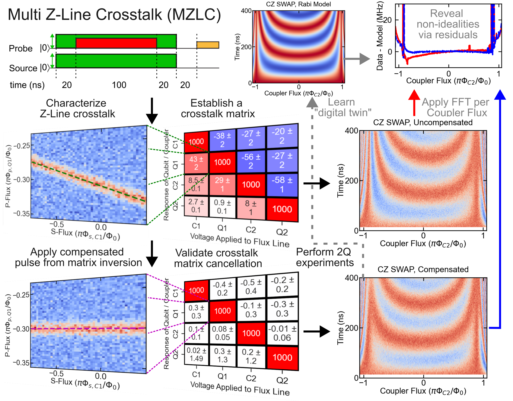

# Dataset structured by M.A.C. Aguila (2025)



Citation: **Aguila, M.A., et al. (2025). Dataset for "Characterizing and Mitigating Flux Crosstalk in Superconducting Qubits-Couplers System". Zenodo. https://doi.org/10.5281/zenodo.17639715**

## 1. Project Overview & Citation

This repository contains the minimal dataset, plotting scripts and post-processed scientific data necessary to reproduce the key findings of the manuscript:

Aguila, M. A. C., et al, (2025). **Characterizing and Mitigating Flux Crosstalk in Superconducting Qubits-Couplers System.** 
https://doi.org/10.48550/arXiv.2508.03434


Version: v1.0.1 (Corresponds to the data used in the first published version of the article, with DOI)

This dataset and its formating ensure that most of the data associated with the processed figure sources from the main text and the supplemental material can be easily accessed, reproduced, and extended for future studies within the group and by collaborators. The data is provided in the NetCDF-4 (.nc) format for long-term preservation and maximum reusability.

The repository follows a standardized data structure and metadata scheme.

## 2. File and Folder Structure
The repository is organized as follows:

| Folder / File | Description |
| --- | --- |
| /data/ | contains all Post-processed and simulated outputs, primarily in NetCDF-4 (.nc) formats. |
| /code/ | Contains the Python scripts used to load data from the data/ folder and generate the editable figures. |
| /figures/ | Data used to generate editable and final figures in the main text and supplemental materials. |
| README.md | Description of data structure and methodology. |
| zenodo.json | Metadata entries for the author list for the dataset. |
| requirements.txt | Listed library requirements for reproducing the plotted figures in the repository. |
| LICENSE.txt | Attribution on reuse. |
| CITATION.cff | File for ease of citation. |

### Figure-to-File Map (Fine Granularity)

To reproduce a specific (nested) figure from the paper, refer to the following required files. Note that all data files are located in the /data/ folder. The plotting scripts are in the /code/ folder. 

| Target Figure | Required Data File(s) | Python Scripts | Content Description |
| --- | --- | --- | --- |
| Main Text Fig. 2 | fig2_.nc, fig2c.nc, fig2d.nc, fig2e.nc, fig2f.nc | plot_fig2.py | Intensity Maps of Flux-dependent spectra of qubits Q1 (fig2c) and Q2 (fig2e), and couplers C1 (fig2d) and C2 (fig2f) with modelled fits |
| Main Text Fig. 3 | fig3_.nc, fig3b.nc, fig3c.nc, fig3d.nc, fig3e.nc, fig3f.nc | plot_fig3.py | Intensity Maps of flux crosstalk between qubits and couplers before and after flux crosstalk compensation, and at different detunings. Modelled fits go alongside this. |
| Main Text Fig. 5 | fig5_.nc, fig5b.nc, fig5c.nc, fig5d.nc, fig5e.nc, fig5ei.nc | plot_fig5.py | Intensity Maps of Coupler-Flux Mediated CZ SWAP prior to flux compensation (fig5b), and after flux compensation (fig5c), and its fig5c digital twin (fig5d). The extracted CZ coupling strength (fig5e) and its residuals are (inset of fig5e) are plotted as well. |
| Supplemental Material Fig. S2 | figs2_.nc, figs2a.nc, figs2b.nc | plot_figs2.py | Intensity Maps of Flux Crosstalk Characterization using a Modified Ramsey Sequence (figs2a) and Q2 (fig2s2b)|
| Supplemental Material Fig. S4 | figs4_.nc | plot_figs4.py | Long time-scale flux pulse duration dependence of Flux Crosstalk (figs4).|
| Supplemental Material Fig. S5 | figs5_.nc, figs5a.nc, figs5b.nc, figs5c.nc, figs5d.nc | plot_figs5.py | Simulation of the Flux-dependent Normalized Rabi Amplitude $`\theta(\Phi=0)/\theta(\Phi)`$ (figs5a), Rabi Drive ($`\theta(\Phi)/\text{T}`$) (figs5b) and Full-Width Half Maximum (FWHM) (figs5c) of qubit Q1 and coupler C1. A simulated intensity map of the state probability of the coupler C1 flux vs XY drive frequency at $`\theta(\Phi=0)/\text{T}=\pi/8`$ drive is plotted (figs5d). |
| Supplemental Material Fig. S6 | figs6_.nc, figs6a.nc, figs6b.nc | plot_figs6.py | Effect of unwanted frequency detuning on single-qubit gate (particularly X gate) fidelity and clifford errors (figs6a). This effect is repeated for numerous gate counts and on selected frequency detunings.|
| Graphical Abstract | fig3b.nc, fig3c.nc, fig4a.nc, fig4c.nc, fig5b.nc, fig5c.nc, fig5ei.nc | plot_graph_abs.py | Graphical Abstract representing the work

The editable and finalized figures are in the **/figures/** folder, under the **/editable_source/** and **/final_figures/** subfolders, respectively. Editable figures generated by the python scripts in the **/code/** folder are saved as PNG (.png)  images, which is in the **/editable_source/** subfolder. They are then edited using Inkscape by adding corresponding cartoons and figure markers and are saved as a scalable vector graphic (.svg) file in the **/editable_source/** subfolder. The finalized figures are exported as PDF (.pdf) images and are saved in the **/final_figures/** subfolder. 

## Data Retrieval Workflow (Simplified)

Data retrieval is handled by a custom function in util_functions.py, which abstracts the underlying xarray and NetCDF complexity. The plotting scripts only interact with standard Python dictionaries. For quick retrieval, we used the **xr_load_nc_to_dict(filename)** function from util_functions.py to retrieve the dictionaries that contain the 1D and 2D arrays in the **x-** and **y-axes**, and **z-axis** for all files. Note that **data with filenames having an underscore (i.e. fig2_.nc, figs2_.nc)** represents the **figure sizes** and **legends configuration** of each nested figure. 

### Variable Naming Conventions (X, Y, Z Axes)

Variable names within the retrieved Python dictionaries follow a consistent convention related to the physical quantity.

| Plot | Physical Quantity | Examples of formats | Description |
| --- | --- | --- | --- |
| 1D | X-axes (swept parameters) | x_V_(volts), x_det_(MHz), x_norm_phi | Parameters varied during the experiment (e.g., sweep_flux, param_duration). |
| 1D | Y-axis (measured parameters) | y_fwhm_(MHz), y_xtalk, y_Fid | Core measured (simulated) outcomes (e.g., $`\|1\rangle`$ state population for 1Q, clifford errors, qubit frequencies, full-width half maximum, Rabi drive, normalized Rabi Angle, etc.). |
| 2D | X-axis (swept parameters) | x_norm_phi, x_V_(volts), xfit_V_(volts) | Parameters varied during the experiment (e.g., sweep_flux, param_duration). |
| 2D | Y-axis (swept parameters) | y_norm_phi, y_fxy_(MHz), y_time_(ns), yfit_fxy_(MHz) | Parameters varied during the experiment (e.g., sweep_flux, param_duration). |
| 2D | Z-axis (measured / simulated parameters) | z_vrms_(uV), z_pop_(%) | Readout voltages (or state probabilities) representing the $\|1\rangle$ state population (e.g., $`\text{P}_{\|11\rangle}`$, $`\text{P}_{\|1\rangle}`$ ADC-I ($`\mu\text{V}`$)). |
| 1D / 2D | Metadata / Configuration | Stored in .attrs | All configuration dictionaries (like x, y, and z-axis labels, plot settings, legend descriptions, and names of elements per figure) are stored as global NetCDF attributes.  |

All of these variables are listed in the plotting scripts of the /code/ folder. For the case of twinX and twinY axes, the variable naming convention still holds for both x and y, but with an addition of 2 (e.g. x2_norm_phi, y2_err, etc.). Any variabls of axes +'fit' plus a parameter and unit (e.g. xfit_fxy_(MHz), yfit_fxy_(MHz), etc) represent a best-fit to summarize a 2D-color map into 1D plot but superimposed in a 2D color map for clarity.

All plotting scripts in code have well-defined x, y and z data and are labelled properly. One can confirm these variable designations by using **IDE with variable explorers (e.g. vscode, Spyder 5.4.4. for this work)** to check the variable names and arrays for each dataset, and their corresponding labels, ticks and other formats essential to reproduce the figures seen in both the main text and the supplemental material. 

Custom-made plots to make plotting of certain images less verbose are listed in **util_functions.py** like 2D color maps (**color_map**) and colored confusion matrices(**conf_matrix_standard**). Check the **util_functions.py** for a minimalist description.  

## 3. Reproducibility and Environment Setup
The data analysis and figure generation can be fully reproduced using the Python environment defined below.

### A. Dependencies

All necessary dependencies for running the analysis and plotting scripts are listed in **requirements.txt.** Note that earlier versions of the dependencies can be used but their compatibility to one another must be crosschecked either using Conda, Mamba or pip. The version of the dependencies used in this database reflect the version that the curator used.

### A. Installation (Optional)

#### 4.1. Clone the Repository:
```Bash
git clone https://github.com/myrronaguila
cd zline_xtalk_template_v1
```

#### 4.2. Create Environment: We highly recommend using a virtual environment  iun nstall dependencies. (optional)
```Bash 
# Create a new virtual environment (e.g., using mamba, conda or venv)
conda create -n zenodo_env python=3.10
conda activate zenodo_env 

# Install dependencies
pip install -r requirements.txt
```

### B. Generating Figures
The scripts under the /code/ directory (i.e. plot_fig2.py, plot_figs2.py, etc.) reads the data_fig2c.nc file and uses matplotlib to reproduce the nested figures as it is shown in the manuscript. 

Execution command:
```Bash
python code/plot_fig2.py
```

Output: The script will output new image files (i.e. fig2bcde.png, figs2ab.png, etc.) into the figures/editable directory, allowing for direct comparison with the final images archived in **/final_figures/** subfolder.

## 5. Dataset Authors and Contributions, Acknowledgement, License, Funding and Citation
### 5.1. Dataset Authors and Contributions

This Zenodo dataset, data structure and metadata standard was originally prepared by M.A.C. Aguila in collaboration with C.-T. Ke.

 The CRediT roles listed below refer specifically to the preparation, organization, validation, and documentation of the dataset deposited in Zenodo. 

| Name | CRediT Role | ORCID iD |
| --- | --- | --- |
| Aguila, Myrron Albert Callera | Conceptualization; Data Curation; Software; Writing – Documentation | https://orcid.org/0000-0002-7910-8609 |
| Li, Nien-Yu | Investigation; Data Curation | https://orcid.org/0009-0001-2537-5277 |
| Chen, Chii-Dong | Supervision; Validation; Funding | https://orcid.org/0000-0002-4046-6943 |
| Ke, Chung-Ting | Conceptualization; Supervision; Funding | https://orcid.org/0000-0002-6031-4226 |

#### Note on Data Curations

In the associated manuscript, the “Data Curation” role includes additional coauthors who contributed to data processing, interpretation, or verification within the context of the scientific study (and all data presented). Only the individuals who directly handled the compilation and formatting of this dataset (which does not include actual device images and other data) are listed under “Data Curation” for this deposit, in accordance with Zenodo and FAIR data guidelines. The full manuscript authorship list reflects broader involvement in experimental design, analysis, and validation that extend beyond the preparation of the deposited dataset.

### 5.2. Acknowledgements

We acknowledge the support of the Quantum Computing Test Space (QC-Test) of the Thematic Center for Quantum Computer in the Research Center for Critical Issues of Academia Sinica (AS-RCCI) for providing measurement access during data acquisition. We are grateful for the coauthors in the associated manuscript who made the experimental work possible.

### 5.3. License
This dataset is released under the Creative Commons Attribution 4.0 International (CC BY 4.0) License.

### 5.4. Funding
This work was supported by the following grants: 
| Grant ID | Affiliation |
|--- | --- |
| AS-GCP-112-M01 | Academia Sinica (AS) |
| AS-GCS-114-M04 | Academia Sinica (AS) |
| AS-KPQ-111-TQRB | Academia Sinica (AS) | 

### 5.5. Usage and Citation
Please cite both the published article and the Zenodo record when using the dataset. The dataset should be cited as:

**Aguila, M.A., et al. (2025). Dataset for "Characterizing and Mitigating Flux Crosstalk in Superconducting Qubits-Couplers System". Zenodo. https://doi.org/10.5281/zenodo.17639715**

The current structure serves as the reference template for subsequent data uploads in this series. If you adapt or extend this structure, please include a reference or acknowledgement to this Zenodo record to maintain continuity and traceability across related datasets. We recommend citation tag for related works:

```Bash
“Data structure and metadata template adapted from Aguila et al. (2025, Zenodo DOI: 10.5281/zenodo.17639716).”
```

## 6. Contacts
For questions or clarification regarding the dataset, data structure or metadata schema, please contact:

📧 Myrron Albert Aguila – maguila@as.sinica.edu.tw

ORCID: [\[0000-0002-7910-8609\]](https://orcid.org/0000-0002-7910-8609)

📧 Chung-Ting Ke – ctke@as.sinica.edu.tw

ORCID: [\[0000-0002-6031-4226\]](https://orcid.org/0000-0002-6031-4226)


## 7. Versions History

v1.0.0-origin (2025-11-18): Initial release; establishes template structure and metadata conventions.

v1.0.1 (2025-11-18): Added the DOI [README.md, citation.ctf, zenodo.json] uploaded to zenodo.
